[↑ Main contents](contents.md)

## Contents
* [pip-amber](#pip-amber)
* [pip-black](#pip-black)
* [pip-blue](#pip-blue)
* [pip-candy](#pip-candy)
* [pip-dark](#pip-dark)
* [pip-green](#pip-green)
* [pip-grey](#pip-grey)
* [pip-navy](#pip-navy)
* [pip-orange](#pip-orange)
* [pip-pink](#pip-pink)
* [pip-unicorn-dark](#pip-unicorn-dark)

### pip-amber
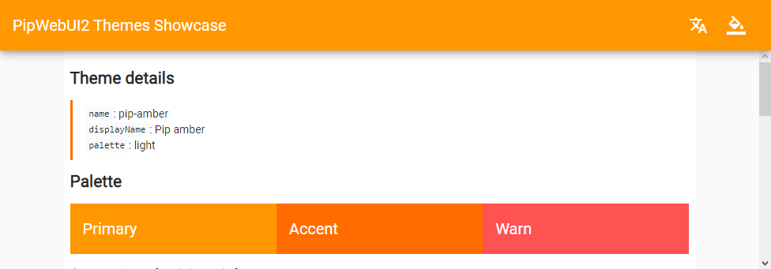
### pip-black
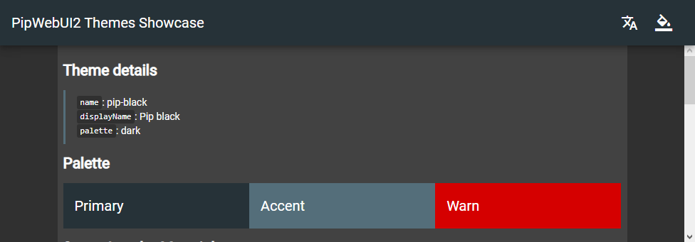
### pip-blue
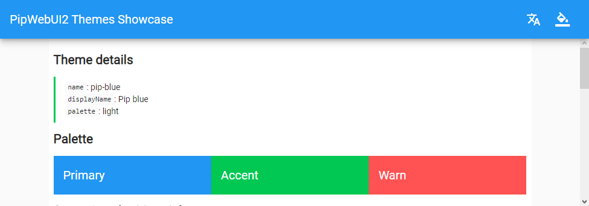
### pip-candy
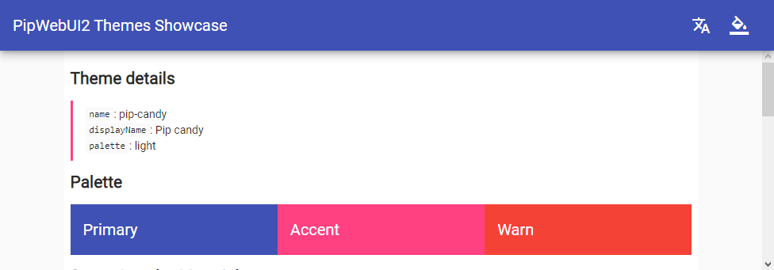
### pip-dark
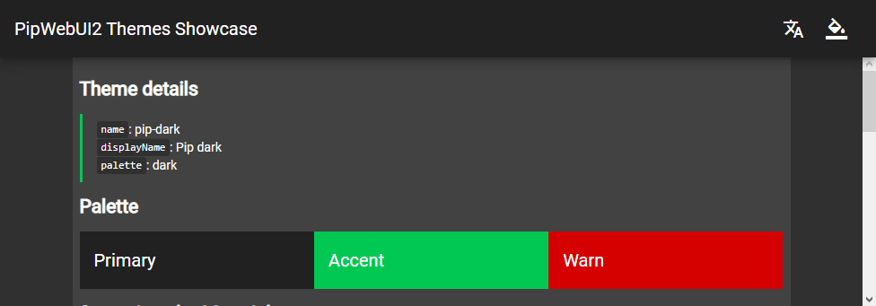
### pip-green
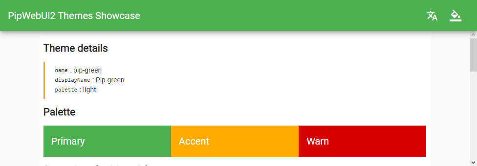
### pip-grey
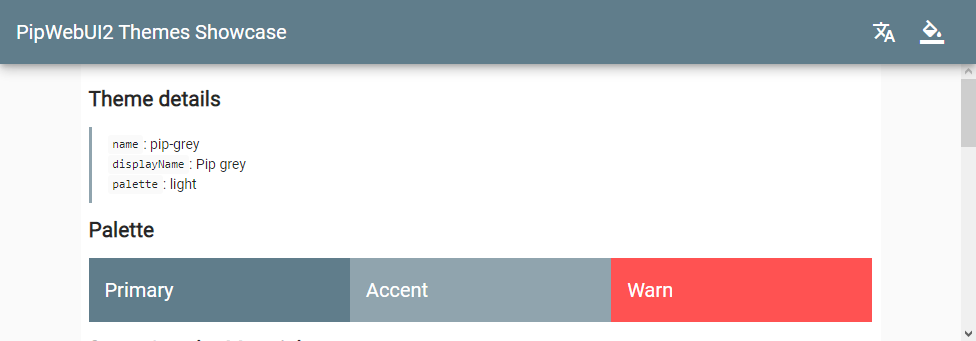
### pip-navy
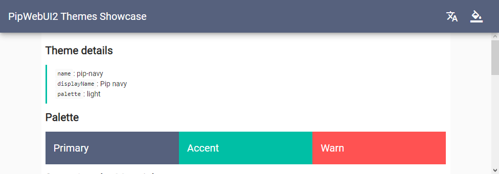
### pip-orange
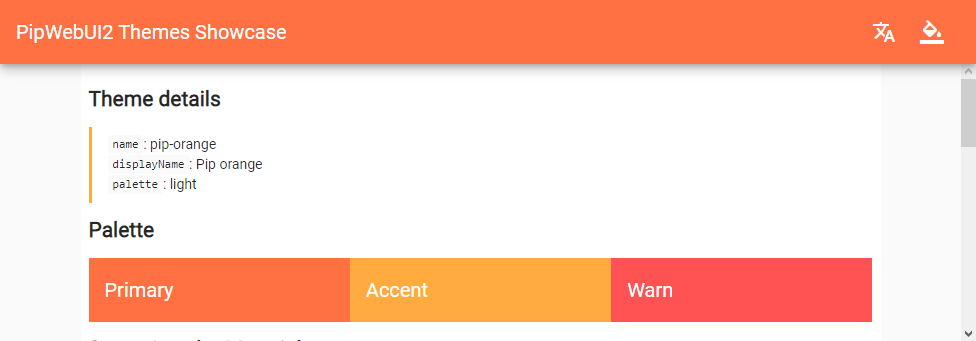
### pip-pink
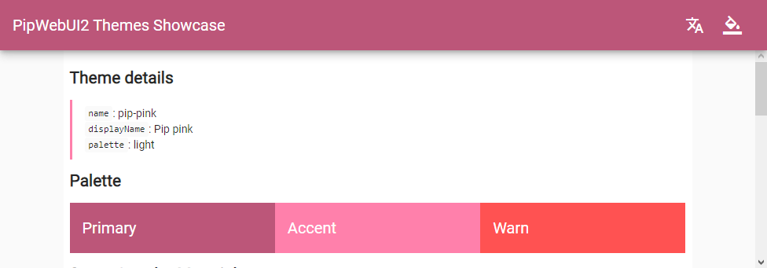
### pip-unicorn-dark
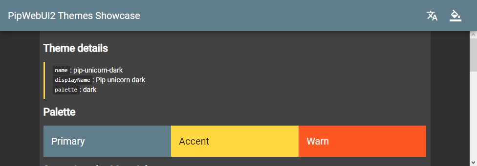